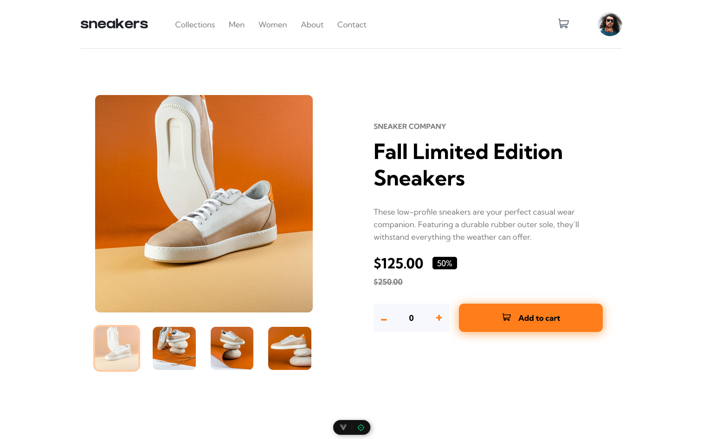
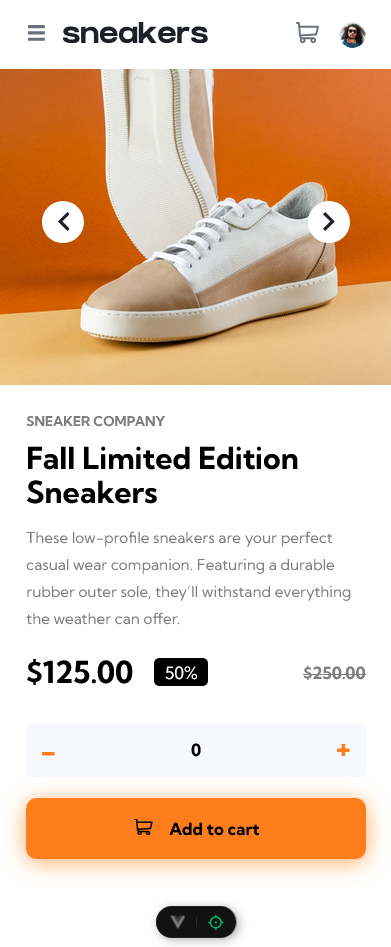

# 🛒 E-commerce Page

Uma tela responsiva de e-commerce desenvolvida com Vue.js e Sass.

## 🌍 Demo
🔗 [Acesse o projeto online](https://ecommerce-page-alpha.vercel.app/)

## 🖼️ Preview
### Desktop:


### Mobile:


## 🛠️ Tecnologias Utilizadas
- Vue.js
- Sass (SCSS)
- HTML5 & CSS3
- Responsividade com Flexbox e Grid

## 📂 Estrutura do Projeto
```
/public
  ├── images/
  ├── preview-desktop.png
  ├── preview-mobile.png
/src
  ├── components/
  ├── assets/
  ├── App.vue
  ├── main.js
```

## 🚀 Como Rodar o Projeto
1. Clone este repositório:
   ```sh
   git clone https://github.com/seu-usuario/seu-repositorio.git
   ```
2. Acesse a pasta do projeto:
   ```sh
   cd my-app
   ```
3. Instale as dependências:
   ```sh
   npm install
   ```
4. Execute o projeto:
   ```sh
   npm run dev
   ```
5. Acesse no navegador:
   ```sh
   http://localhost:5173
   ```

## 📜 Licença
Este projeto está sob a licença MIT. Sinta-se à vontade para utilizá-lo e modificá-lo!
